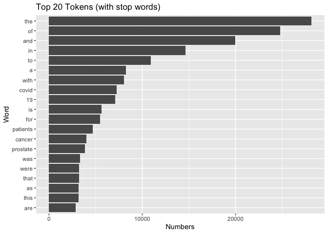
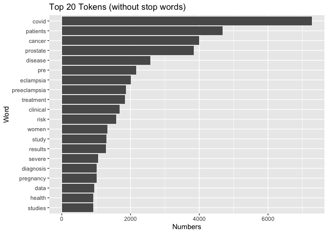
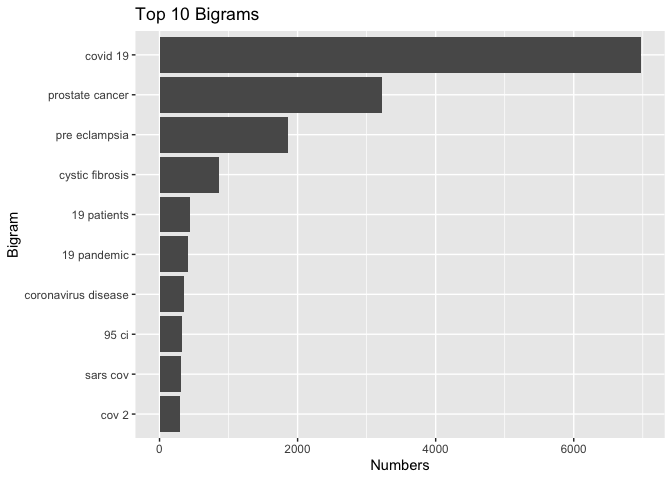

HW3
================
Xuan Huang
2022-11-05

# APIs

-   Using the NCBI API, look for papers that show up under the term
    “sars-cov-2 trial vaccine.” Look for the data in the pubmed
    database, and then retrieve the details of the paper as shown in
    lab 7. How many papers were you able to find?

``` r
# Download web, and count the numbers
website <- xml2::read_html("https://pubmed.ncbi.nlm.nih.gov/?term=sars-cov-2+trial+vaccine")

counts <- xml2::xml_find_first(website, "/html/body/main/div[9]/div[2]/div[2]/div[1]/div[1]/span")

counts <- as.character(counts)
```

``` r
stringr::str_extract(counts, "[0-9,]+")
```

    ## [1] "4,009"

``` r
# we found 4009 papers
```

-   Using the list of pubmed ids you retrieved, download each papers’
    details using the query parameter rettype = abstract. If you get
    more than 250 ids, just keep the first 250.

``` r
# download details for first 250, get those IDs
query_ids <- GET(
      url   = "https://eutils.ncbi.nlm.nih.gov/",
      path = "entrez/eutils/esearch.fcgi",
      query = list(db       = "pubmed",
                   term     = "sars-cov-2 trial vaccine",
                   rettype = "abstract",
                   retmax   = 250)
    )
ids <- httr::content(query_ids)
ids <- as.character(ids)
ids <- stringr::str_extract_all(ids, "<Id>[0-9]+</Id>")[[1]]
ids <- stringr::str_remove_all(ids, "<Id>|</Id>")
```

-   As we did in lab 7. Create a dataset containing the following:

Pubmed ID number, Title of the paper, Name of the journal where it was
published, Publication date, and Abstract of the paper (if any).

``` r
# create a dataset contain those information
publications <- GET(
  url = "https://eutils.ncbi.nlm.nih.gov/",
  path = "entrez/eutils/efetch.fcgi",
  query = list(
    db = "pubmed",
    id = paste(ids, collapse = ","),
    retmax = 250,
    rettype = "abstract"
    ))
publications <- httr::content(publications)
publications_txt <- as.character(publications)

pub_char_list <- xml2::xml_children(publications)
pub_char_list <- sapply(pub_char_list, as.character)
    
# From Lab 7, and the other variables are modeled after the next three lines of code
abstracts <- str_extract(pub_char_list, "<Abstract>[[:print:][:space:]]+</Abstract>")
abstracts <- str_remove_all(abstracts, "</?[[:alnum:]- =\"]+>")
abstracts <- str_replace_all(abstracts, "[[:space:]]+", " ")

# For article titles...
titles <- str_extract(pub_char_list, "<ArticleTitle>[[:print:][:space:]]+</ArticleTitle>")
titles <- str_remove_all(titles, "</?[[:alnum:]- =\"]+>")
  
# For journal titles...
journals <- str_extract(pub_char_list, "<Title>[[:print:][:space:]]+</Title>")
journals <- str_remove_all(journals, "</?[[:alnum:]- =\"]+>") 
journals <- str_replace_all(journals, "[[:space:]]+", " ")
  
# For publciation dates
dates <- str_extract(pub_char_list, "<PubDate>[[:print:][:space:]]+</PubDate>")
dates <- str_remove_all(dates, "</?[[:alnum:]- =\"]+>")
dates <- str_replace_all(dates, "[[:space:]]+", " ")

database <- data.frame(
      PubMedID = ids,
      Title = titles,
      Journal = journals,
      PubDate = dates,
      Abstract = abstracts
    )

## show the table
knitr::kable(database[1:20, ], caption = "Twenty papers about SARS-CoV-2 Trial Vaccines")
```

| PubMedID | Title                                                                                                                                                                                                                     | Journal                                           | PubDate     | Abstract                                                                                                                                                                                                                                                                                                                                                                                                                                                                                                                                                                                                                                                                                                                                                                                                                                                                                                                                                                                                                                                                                                                                                                                                                                                                                                                                                                                                                                                                                                                                                                                                                                                                                                                                                                                                                                                                                                                                                                                                                                                                                                                                                                                                                                                                                                                                                                                                                                                                                                                                                                                                                                                                                                                                                                                                                                                                                                                                                                                                                                                                                                                                                                                                                                                                                                                                                                                                                                                                                                                                                                                                                                                                                                                                                                                                                                                                                                                                                  |
|:---------|:--------------------------------------------------------------------------------------------------------------------------------------------------------------------------------------------------------------------------|:--------------------------------------------------|:------------|:----------------------------------------------------------------------------------------------------------------------------------------------------------------------------------------------------------------------------------------------------------------------------------------------------------------------------------------------------------------------------------------------------------------------------------------------------------------------------------------------------------------------------------------------------------------------------------------------------------------------------------------------------------------------------------------------------------------------------------------------------------------------------------------------------------------------------------------------------------------------------------------------------------------------------------------------------------------------------------------------------------------------------------------------------------------------------------------------------------------------------------------------------------------------------------------------------------------------------------------------------------------------------------------------------------------------------------------------------------------------------------------------------------------------------------------------------------------------------------------------------------------------------------------------------------------------------------------------------------------------------------------------------------------------------------------------------------------------------------------------------------------------------------------------------------------------------------------------------------------------------------------------------------------------------------------------------------------------------------------------------------------------------------------------------------------------------------------------------------------------------------------------------------------------------------------------------------------------------------------------------------------------------------------------------------------------------------------------------------------------------------------------------------------------------------------------------------------------------------------------------------------------------------------------------------------------------------------------------------------------------------------------------------------------------------------------------------------------------------------------------------------------------------------------------------------------------------------------------------------------------------------------------------------------------------------------------------------------------------------------------------------------------------------------------------------------------------------------------------------------------------------------------------------------------------------------------------------------------------------------------------------------------------------------------------------------------------------------------------------------------------------------------------------------------------------------------------------------------------------------------------------------------------------------------------------------------------------------------------------------------------------------------------------------------------------------------------------------------------------------------------------------------------------------------------------------------------------------------------------------------------------------------------------------------------------------------------|
| 36328399 | Immunogenicity and safety of a three-dose SARS-CoV-2 vaccination strategy in patients with immune-mediated inflammatory diseases on immunosuppressive therapy.                                                            | RMD open                                          | 2022 Nov    | Humoral vaccine responses to SARS-CoV-2 vaccines are impaired and short lasting in patients with immune-mediated inflammatory diseases (IMID) following two vaccine doses. To protect these vulnerable patients against severe COVID-19 disease, a three-dose primary vaccination strategy has been implemented in many countries. The aim of this study was to evaluate humoral response and safety of primary vaccination with three doses in patients with IMID. Patients with IMID on immunosuppressive therapy and healthy controls receiving three-dose and two-dose primary SARS-CoV-2 vaccination, respectively, were included in this prospective observational cohort study. Anti-Spike antibodies were assessed 2-4 weeks, and 12 weeks following each dose. The main outcome was anti-Spike antibody levels 2-4 weeks following three doses in patients with IMID and two doses in controls. Additional outcomes were the antibody decline rate and adverse events. 1100 patients and 303 controls were included. Following three-dose vaccination, patients achieved median (IQR) antibody levels of 5720 BAU/mL (2138-8732) compared with 4495 (1591-6639) in controls receiving two doses, p=0.27. Anti-Spike antibody levels increased with median 1932 BAU/mL (IQR 150-4978) after the third dose. The interval between the vaccine doses and vaccination with mRNA-1273 or a combination of vaccines were associated with antibody levels following the third dose. Antibody levels had a slower decline-rate following the third than the second vaccine dose, p\<0.001. Adverse events were reported by 464 (47%) patients and by 196 (78%) controls. Disease flares were reported by 70 (7%) patients. This study shows that additional vaccine doses to patients with IMID contribute to strong and sustained immune-responses comparable to healthy persons vaccinated twice, and supports repeated vaccination of patients with IMID. NCT04798625. © Author(s) (or their employer(s)) 2022. Re-use permitted under CC BY-NC. No commercial re-use. See rights and permissions. Published by BMJ.                                                                                                                                                                                                                                                                                                                                                                                                                                                                                                                                                                                                                                                                                                                                                                                                                                                                                                                                                                                                                                                                                                                                                                                                                                                                                                                                                                                                                                                                                                                                                                                                                                                                                                                                                                                                                                  |
| 36327352 | S-217622, a SARS-CoV-2 main protease inhibitor, decreases viral load and ameliorates COVID-19 severity in hamsters.                                                                                                       | Science translational medicine                    | 2022 Nov 03 | In parallel with vaccination, oral antiviral agents are highly anticipated to act as countermeasures for the treatment of the coronavirus disease 2019 (COVID-19) pandemic caused by severe acute respiratory syndrome coronavirus 2 (SARS-CoV-2). Oral antiviral medication demands not only high antiviral activity, but also target specificity, favorable oral bioavailability, and high metabolic stability. Although a large number of compounds have been identified as potential inhibitors of SARS-CoV-2 infection in vitro, few have proven to be effective in vivo. Here, we show that oral administration of S-217622 (ensitrelvir), an inhibitor of SARS-CoV-2 main protease (Mpro, also known as 3C-like protease), decreases viral load and ameliorates disease severity in SARS-CoV-2-infected hamsters. S-217622 inhibited viral proliferation at low nanomolar to sub-micromolar concentrations in cells. Oral administration of S-217622 demonstrated favorable pharmacokinetic properties and accelerated recovery from acute SARS-CoV-2 infection in hamster recipients. Moreover, S-217622 exerted antiviral activity against SARS-CoV-2 variants of concern (VOCs), including the highly pathogenic Delta variant and the recently emerged Omicron BA.5 and BA.2.75 variants. Overall, our study provides evidence that S-217622, an antiviral agent that is under evaluation in a phase 3 clinical trial (clinical trial registration no. jRCT2031210350), possesses remarkable antiviral potency and efficacy against SARS-CoV-2 and is a prospective oral therapeutic option for COVID-19.                                                                                                                                                                                                                                                                                                                                                                                                                                                                                                                                                                                                                                                                                                                                                                                                                                                                                                                                                                                                                                                                                                                                                                                                                                                                                                                                                                                                                                                                                                                                                                                                                                                                                                                                                                                                                                                                                                                                                                                                                                                                                                                                                                                                                                                                                                                                      |
| 36322837 | Covid-19 Vaccine Protection among Children and Adolescents in Qatar.                                                                                                                                                      | The New England journal of medicine               | 2022 Nov 02 | The BNT162b2 vaccine against coronavirus disease 2019 (Covid-19) has been authorized for use in children 5 to 11 years of age and adolescents 12 to 17 years of age but in different antigen doses. We assessed the real-world effectiveness of the BNT162b2 vaccine against infection with severe acute respiratory syndrome coronavirus 2 (SARS-CoV-2) among children and adolescents in Qatar. To compare the incidence of SARS-CoV-2 infection in the national cohort of vaccinated participants with the incidence in the national cohort of unvaccinated participants, we conducted three matched, retrospective, target-trial, cohort studies - one assessing data obtained from children 5 to 11 years of age after the B.1.1.529 (omicron) variant became prevalent and two assessing data from adolescents 12 to 17 years of age before the emergence of the omicron variant (pre-omicron study) and after the omicron variant became prevalent. Associations were estimated with the use of Cox proportional-hazards regression models. Among children, the overall effectiveness of the 10-μg primary vaccine series against infection with the omicron variant was 25.7% (95% confidence interval \[CI\], 10.0 to 38.6). Effectiveness was highest (49.6%; 95% CI, 28.5 to 64.5) right after receipt of the second dose but waned rapidly thereafter and was negligible after 3 months. Effectiveness was 46.3% (95% CI, 21.5 to 63.3) among children 5 to 7 years of age and 16.6% (95% CI, -4.2 to 33.2) among those 8 to 11 years of age. Among adolescents, the overall effectiveness of the 30-μg primary vaccine series against infection with the omicron variant was 30.6% (95% CI, 26.9 to 34.1), but many adolescents had been vaccinated months earlier. Effectiveness waned over time since receipt of the second dose. Effectiveness was 35.6% (95% CI, 31.2 to 39.6) among adolescents 12 to 14 years of age and 20.9% (95% CI, 13.8 to 27.4) among those 15 to 17 years of age. In the pre-omicron study, the overall effectiveness of the 30-μg primary vaccine series against SARS-CoV-2 infection among adolescents was 87.6% (95% CI, 84.0 to 90.4) and waned relatively slowly after receipt of the second dose. Vaccination in children was associated with modest, rapidly waning protection against omicron infection. Vaccination in adolescents was associated with stronger, more durable protection, perhaps because of the larger antigen dose. (Funded by Weill Cornell Medicine-Qatar and others.). Copyright © 2022 Massachusetts Medical Society.                                                                                                                                                                                                                                                                                                                                                                                                                                                                                                                                                                                                                                                                                                                                                                                                                                                                                                                                                                                                                                                                                                                                                                                                                                                                                                                                                            |
| 36320825 | Withholding methotrexate after vaccination with ChAdOx1 nCov19 in patients with rheumatoid or psoriatic arthritis in India (MIVAC I and II): results of two, parallel, assessor-masked, randomised controlled trials.     | The Lancet. Rheumatology                          | 2022 Nov    | There is a necessity for an optimal COVID-19 vaccination strategy for vulnerable population groups, including people with autoimmune inflammatory arthritis on immunosuppressants such as methotrexate, which inhibit vaccine-induced immunity against SARS-CoV-2. Thus, we aimed to assess the effects of withholding methotrexate for 2 weeks after each dose of ChAdOx1 nCov-19 (Oxford-AstraZeneca) vaccine (MIVAC I) or only after the second dose of vaccine (MIVAC II) compared with continuation of methotrexate, in terms of post-vaccination antibody titres and disease flare rates. MIVAC I and II were two parallel, independent, assessor-masked, randomised trials. The trials were done at a single centre (Dr Shenoy’s Centre for Arthritis and Rheumatism Excellence; Kochi, India) in people with either rheumatoid arthritis or psoriatic arthritis with stable disease activity, who had been on a fixed dose of methotrexate for the preceding 6 weeks. Those with previous COVID-19 or who were positive for anti-SARS-CoV-2 nucleocapsid antibodies were excluded from the trials. People on high-dose corticosteroids and rituximab were also excluded, whereas other disease-modifying antirheumatic drugs were allowed. In MIVAC I, participants were randomly assigned (1:1) to stop methotrexate treatment for 2 weeks after each vaccine dose or to continue methotrexate treatment. In MIVAC II, participants who had continued methotrexate during the first dose of vaccine were randomly assigned (1:1) to withhold methotrexate for 2 weeks after the second dose of vaccine or to continue to take methotrexate. The treating physician was masked to the group assignments. The primary outcome for both MIVAC I and MIVAC II was the titre (absolute value) of anti-receptor binding domain (RBD) antibody measured 4 weeks after the second dose of vaccine. All analyses were done per protocol. The trials were registered with the Clinical Trials Registry- India, number CTRI/2021/07/034639 (MIVAC I) and CTRI/2021/07/035307 (MIVAC II). Between July 6 and Dec 15, 2021, participants were recruited to the trials. In MIVAC I, 250 participants were randomly assigned and 158 completed the study as per the protocol (80 in the methotrexate hold group and 78 in the control group; 148 \[94%\] were women and 10 \[6%\] were men). The median post-vaccination antibody titres in the methotrexate hold group were significantly higher compared with the control group (2484·0 IU/mL, IQR 1050·0-4388·8 vs 1147·5 IU/mL, 433·5-2360·3; p=0·0014). In MIVAC II, 178 participants were randomly assigned and 157 completed the study per protocol (76 in the methotrexate hold group and 81 in the control group; 135 \[86%\] were women and 22 \[14%\] were men). The methotrexate hold group had higher post-vaccination antibody titres compared with the control group (2553·5 IU/ml, IQR 1792·5-4823·8 vs 990·5, 356·1-2252·5; p\<0·0001). There were no reports of any serious adverse events during the trial period. Withholding methotrexate after both ChAdOx1 nCov-19 vaccine doses and after only the second dose led to higher anti-RBD antibody titres compared with continuation of methotrexate. However, withholding methotrexate only after the second vaccine dose resulted in a similar humoral response to holding methotrexate after both vaccine doses, without an increased risk of arthritis flares. Hence, interruption of methotrexate during the second dose of ChAdOx1 nCov-19 vaccine appears to be a safe and effective strategy to improve the antibody response in patients with rheumatoid or psoriatic arthritis. Indian Rheumatology Association. © 2022 Elsevier Ltd. All rights reserved.                                                                                                                                                                        |
| 36314847 | An online community peer support intervention to promote COVID-19 vaccine information among essential workers: a randomized trial.                                                                                        | Annals of medicine                                | 2022 Dec    | Vaccine hesitancy is still rampant in the United States, including health care personnel. Vaccination of frontline essential workers (e.g. health care workers) is very important, especially during a pandemic. We tested the efficacy of a 4-week online, peer-led intervention (Harnessing Online Peer Education) to promote requests for COVID-19 vaccine information among essential workers. Participants (N = 120) and peer leaders (N = 12) were recruited through online advertisements from July 23 to August 20, 2021. Eligibility criteria included: 18 years or older, U.S. resident, English speaker, part of phase 1a or 1 b of COVID-19 vaccine rollout (e.g. frontline essential workers), hadn’t received a COVID-19 vaccine but able to receive one. This was a parallel assignment randomised trial. STATA was used to create a randomisation using a random number generator so that all possible assignments of participants and peer leaders to groups were equally likely. Participants were randomly assigned to intervention or control arms that consisted of two private, hidden Facebook groups, each with 30 participants. Peer leaders were randomly assigned to an intervention group, each with six peer leaders. Participants in the intervention arm were randomly assigned to three peer leaders. Participants were blinded after assignment. Peer leaders were tasked with reaching out to their assigned participants at least three times each week. Participants completed a baseline and a post intervention survey. The study is registered on ClinicalTrials.org under identifier NCT04376515 and is no longer recruiting. This work was supported by the NIAID under grant 5R01AI132030-05. A total of 101 participants analysed (50 intervention and 51 control). Six people in the intervention group and 0 people in the control group requested vaccine information. Ten people in the intervention group and six people in the control group provided proof of vaccination. The odds of requesting vaccine information in the intervention group was 13 times that in the control group (95% confidence interval: (1.5, 1772), p-value = 0.015). Thirty-seven participants in the intervention group and 31 in the control group were engaged at some point during the study. Results suggest peer-led online community groups may help to disseminate health information, aid public health efforts, and combat vaccine hesitancy. Key MessagesThe odds of requesting vaccine information was 13 times in the intervention group.Peer-led online communities may help to disseminate information and aid public health efforts to combat vaccine hesitancy.                                                                                                                                                                                                                                                                                                                                                                                                                                                                                                                                                                                                                                                                                                                                                                                                                                                                                                                                                                                                                                                                                                                                                                                                                                             |
| 36307830 | Improving pediatric COVID-19 vaccine uptake using an mHealth tool (MoVeUp): study protocol for a randomized, controlled trial.                                                                                            | Trials                                            | 2022 Oct 28 | Coronavirus disease 2019 (COVID-19) vaccines demonstrate excellent effectiveness against infection, severe disease, and death. However, pediatric COVID-19 vaccination rates lag among individuals from rural and other medically underserved communities. The research objective of the current protocol is to determine the effectiveness of a vaccine communication mobile health (mHealth) application (app) on parental decisions to vaccinate their children against COVID-19. Custodial parents/caregivers with ≥ 1 child eligible for COVID-19 vaccination who have not yet received the vaccine will be randomized to download one of two mHealth apps. The intervention app will address logistical and motivational barriers to pediatric COVID-19 vaccination. Participants will receive eight weekly push notifications followed by two monthly push notifications (cues to action) regarding vaccinating their child. Through branching logic, users will access customized content based on their locality, degree of rurality-urbanicity, primary language (English/Spanish), race/ethnicity, and child’s age to address COVID-19 vaccine knowledge and confidence gaps. The control app will provide push notifications and information on general pediatric health and infection prevention and mitigation strategies based on recommendations from the American Academy of Pediatrics (AAP) and the Centers for Disease Control and Prevention (CDC). The primary outcome is the proportion of children who complete COVID-19 vaccination series. Secondary outcomes include the proportion of children who receive ≥ 1 dose of COVID-19 vaccine and changes in parent/caregiver scores from baseline to immediately post-intervention on the modified WHO SAGE Vaccine Hesitancy Scale adapted for the COVID-19 vaccine. The COVID-19 pandemic inflicts disproportionate harm on individuals from underserved communities, including those in rural settings. Maximizing vaccine uptake in these communities will decrease infection rates, severe illness, and death. Given that most US families from these communities use smart phones, mHealth interventions hold the promise of broad uptake. Bundling multiple mHealth vaccine uptake interventions into a single app may maximize the impact of deploying such a tool to increase COVID-19 vaccination. The new knowledge to be gained from this study will directly inform future efforts to increase COVID-19 vaccination rates across diverse settings and provide an evidentiary base for app-based vaccine communication tools that can be adapted to future vaccine-deployment efforts. ClinicalTrials.gov NCT05386355 . Registered on May 23, 2022. © 2022. The Author(s).                                                                                                                                                                                                                                                                                                                                                                                                                                                                                                                                                                                                                                                                                                                                                                                                                                                                                                                                                                                                                                                                                                                                                                                             |
| 36305195 | Deep learning in drug discovery: a futuristic modality to materialize the large datasets for cheminformatics.                                                                                                             | Journal of biomolecular structure & dynamics      | 2022 Oct 28 | Artificial intelligence (AI) development imitates the workings of the human brain to comprehend modern problems. The traditional approaches such as high throughput screening (HTS) and combinatorial chemistry are lengthy and expensive to the pharmaceutical industry as they can only handle a smaller dataset. Deep learning (DL) is a sophisticated AI method that uses a thorough comprehension of particular systems. The pharmaceutical industry is now adopting DL techniques to enhance the research and development process. Multi-oriented algorithms play a crucial role in the processing of QSAR analysis, de novo drug design, ADME evaluation, physicochemical analysis, preclinical development, followed by clinical trial data precision. In this study, we investigated the performance of several algorithms, including deep neural networks (DNN), convolutional neural networks (CNN) and multi-task learning (MTL), with the aim of generating high-quality, interpretable big and diverse databases for drug design and development. Studies have demonstrated that CNN, recurrent neural network and deep belief network are compatible, accurate and effective for the molecular description of pharmacodynamic properties. In Covid-19, existing pharmacological compounds has also been repurposed using DL models. In the absence of the Covid-19 vaccine, remdesivir and oseltamivir have been widely employed to treat severe SARS-CoV-2 infections. In conclusion, the results indicate the potential benefits of employing the DL strategies in the drug discovery process.Communicated by Ramaswamy H. Sarma.                                                                                                                                                                                                                                                                                                                                                                                                                                                                                                                                                                                                                                                                                                                                                                                                                                                                                                                                                                                                                                                                                                                                                                                                                                                                                                                                                                                                                                                                                                                                                                                                                                                                                                                                                                                                                                                                                                                                                                                                                                                                                                                                                                                                                                                                                                        |
| 36301821 | Immunogenicity and reactogenicity of SARS-CoV-2 vaccines in people living with HIV in the Netherlands: A nationwide prospective cohort study.                                                                             | PLoS medicine                                     | 2022 Oct    | Vaccines can be less immunogenic in people living with HIV (PLWH), but for SARS-CoV-2 vaccinations this is unknown. In this study we set out to investigate, for the vaccines currently approved in the Netherlands, the immunogenicity and reactogenicity of SARS-CoV-2 vaccinations in PLWH. We conducted a prospective cohort study to examine the immunogenicity of BNT162b2, mRNA-1273, ChAdOx1-S, and Ad26.COV2.S vaccines in adult PLWH without prior COVID-19, and compared to HIV-negative controls. The primary endpoint was the anti-spike SARS-CoV-2 IgG response after mRNA vaccination. Secondary endpoints included the serological response after vector vaccination, anti-SARS-CoV-2 T-cell response, and reactogenicity. Between 14 February and 7 September 2021, 1,154 PLWH (median age 53 \[IQR 44-60\] years, 85.5% male) and 440 controls (median age 43 \[IQR 33-53\] years, 28.6% male) were included in the final analysis. Of the PLWH, 884 received BNT162b2, 100 received mRNA-1273, 150 received ChAdOx1-S, and 20 received Ad26.COV2.S. In the group of PLWH, 99% were on antiretroviral therapy, 97.7% were virally suppressed, and the median CD4+ T-cell count was 710 cells/μL (IQR 520-913). Of the controls, 247 received mRNA-1273, 94 received BNT162b2, 26 received ChAdOx1-S, and 73 received Ad26.COV2.S. After mRNA vaccination, geometric mean antibody concentration was 1,418 BAU/mL in PLWH (95% CI 1322-1523), and after adjustment for age, sex, and vaccine type, HIV status remained associated with a decreased response (0.607, 95% CI 0.508-0.725, p \< 0.001). All controls receiving an mRNA vaccine had an adequate response, defined as \>300 BAU/mL, whilst in PLWH this response rate was 93.6%. In PLWH vaccinated with mRNA-based vaccines, higher antibody responses were predicted by CD4+ T-cell count 250-500 cells/μL (2.845, 95% CI 1.876-4.314, p \< 0.001) or \>500 cells/μL (2.936, 95% CI 1.961-4.394, p \< 0.001), whilst a viral load \> 50 copies/mL was associated with a reduced response (0.454, 95% CI 0.286-0.720, p = 0.001). Increased IFN-γ, CD4+ T-cell, and CD8+ T-cell responses were observed after stimulation with SARS-CoV-2 spike peptides in ELISpot and activation-induced marker assays, comparable to controls. Reactogenicity was generally mild, without vaccine-related serious adverse events. Due to the control of vaccine provision by the Dutch National Institute for Public Health and the Environment, there were some differences between vaccine groups in the age, sex, and CD4+ T-cell counts of recipients. After vaccination with BNT162b2 or mRNA-1273, anti-spike SARS-CoV-2 antibody levels were reduced in PLWH compared to HIV-negative controls. To reach and maintain the same serological responses as HIV-negative controls, additional vaccinations are probably required. The trial was registered in the Netherlands Trial Register (NL9214). <https://www.trialregister.nl/trial/9214>.                                                                                                                                                                                                                                                                                                                                                                                                                                                                                                                                                                                                                                                                                                                                                                                                                                                                                                                                      |
| 36299427 | Fluvoxamine for Outpatient Treatment of COVID-19: A Decentralized, Placebo-controlled, Randomized, Platform Clinical Trial.                                                                                               | medRxiv : the preprint server for health sciences | 2022 Oct 18 | The effectiveness of fluvoxamine to shorten symptom duration or prevent hospitalization among outpatients in the US with mild to moderate symptomatic coronavirus disease 2019 (COVID-19) is unclear. ACTIV-6 is an ongoing, decentralized, double-blind, randomized, placebo-controlled platform trial testing repurposed medications in outpatients with mild to moderate COVID-19. A total of 1288 non-hospitalized adults aged ≥30 years with confirmed COVID-19 experiencing ≥2 symptoms of acute infection for ≤7 days prior to randomization were randomized to receive fluvoxamine 50 mg or placebo twice daily for 10 days. The primary outcome was time to sustained recovery, defined as the third of 3 consecutive days without symptoms. Secondary outcomes included composites of hospitalization or death with or without urgent or emergency care visit by day 28. Of 1331 participants randomized (mean \[SD\] age, 48.5 \[12.8\] years; 57% women; 67% reported receiving at least 2 doses of a SARS-CoV-2 vaccine), 1288 completed the trial (n=614 placebo, n=674 fluvoxamine). Median time to recovery was 13 days (IQR 12-13) in the placebo group and 12 days (IQR 11-14) in the fluvoxamine group (hazard ratio \[HR\] 0.96, 95% credible interval \[CrI\] 0.86-1.07; posterior probability for benefit \[HR\>1\]=0.22). Twenty-six participants (3.9%) in the fluvoxamine group were hospitalized or had urgent or emergency care visits compared with 23 (3.8%) in the placebo group (HR 1.1, 95% CrI 0.6-1.8; posterior probability for benefit \[HR\<1\]=0.340). One participant in the fluvoxamine group and 2 in the placebo group were hospitalized; no deaths occurred. Adverse events were uncommon in both groups. Treatment with fluvoxamine 50 mg twice daily for 10 days did not improve time to recovery, compared with placebo, among outpatients with mild to moderate COVID-19. These findings do not support the use of fluvoxamine at this dose and duration in patients with mild to moderate COVID-19.                                                                                                                                                                                                                                                                                                                                                                                                                                                                                                                                                                                                                                                                                                                                                                                                                                                                                                                                                                                                                                                                                                                                                                                                                                                                                                                                                                                                                                                                                                                                                                                                                                                                                                                                                                                                                                                                                                       |
| 36298743 | Immunogenicity, Safety, and Anti-Viral Efficacy of a Subunit SARS-CoV-2 Vaccine Candidate in Captive Black-Footed Ferrets (Mustela nigripes) and Their Susceptibility to Viral Challenge.                                 | Viruses                                           | 2022 10 04  | A preliminary vaccination trial against the emergent pathogen, SARS-CoV-2, was completed in captive black-footed ferrets (Mustela nigripes; BFF) to assess safety, immunogenicity, and anti-viral efficacy. Vaccination and boosting of 15 BFF with purified SARS-CoV-2 S1 subunit protein produced a nearly 150-fold increase in mean antibody titers compared to pre-vaccination titers. Serum antibody responses were highest in young animals, but in all vaccinees, antibody response declined rapidly. Anti-viral activity from vaccinated and unvaccinated BFF was determined in vitro, as well as in vivo with a passive serum transfer study in mice. Transgenic mice that received BFF serum transfers and were subsequently challenged with SARS-CoV-2 had lung viral loads that negatively correlated (p &lt; 0.05) with the BFF serum titer received. Lastly, an experimental challenge study in a small group of BFF was completed to test susceptibility to SARS-CoV-2. Despite viral replication and shedding in the upper respiratory tract for up to 7 days post-challenge, no clinical disease was observed in either vaccinated or naive animals. The lack of morbidity or mortality observed indicates SARS-CoV-2 is unlikely to affect wild BFF populations, but infected captive animals pose a potential risk, albeit low, for humans and other animals.                                                                                                                                                                                                                                                                                                                                                                                                                                                                                                                                                                                                                                                                                                                                                                                                                                                                                                                                                                                                                                                                                                                                                                                                                                                                                                                                                                                                                                                                                                                                                                                                                                                                                                                                                                                                                                                                                                                                                                                                                                                                                                                                                                                                                                                                                                                                                                                                                                                                                                                                                                          |
| 36298641 | COVID-19 Vaccines against Omicron Variant: Real-World Data on Effectiveness.                                                                                                                                              | Viruses                                           | 2022 09 20  | The efficacy of vaccines against coronavirus disease 2019 (COVID-19) has now been well established in phase III clinical trials. However, clinical studies based on real-world data remain critical to assess vaccines effectiveness (VE), especially in specific populations and against variants of concern (VOC). This review presents the principles and methods of VE studies and the main available results on VE of COVID-19 vaccines at the time of Omicron circulation. References for this narrative review were identified through searches of PubMed database up to 13 September 2022. The results of phase III clinical trials have been globally confirmed by VE in real-life studies, including in the elderly. Emergence of VOC Omicron emphasized the importance of booster doses to maintain a high level of protection against severe forms. There are still numerous challenges regarding booster(s) and duration of immunity, particularly in specific subpopulations, and regarding the need for adapted vaccines.                                                                                                                                                                                                                                                                                                                                                                                                                                                                                                                                                                                                                                                                                                                                                                                                                                                                                                                                                                                                                                                                                                                                                                                                                                                                                                                                                                                                                                                                                                                                                                                                                                                                                                                                                                                                                                                                                                                                                                                                                                                                                                                                                                                                                                                                                                                                                                                                                                                                                                                                                                                                                                                                                                                                                                                                                                                                                                                  |
| 36287714 | A Novel RBD-Protein/Peptide Vaccine Elicits Broadly Neutralizing Antibodies and Protects Mice and Macaques against SARS-CoV-2.                                                                                            | Emerging microbes & infections                    | 2022 Oct 26 | The development of safe and effective vaccines to respond to COVID-19 pandemic/endemic remains a priority. We developed a novel subunit protein-peptide COVID-19 vaccine candidate (UB-612) composed of: (i) receptor binding domain of SARS-CoV-2 spike protein fused to a modified single-chain human IgG1 Fc; (ii) five synthetic peptides incorporating conserved helper and cytotoxic T lymphocyte (Th/CTL) epitopes derived from SARS-CoV-2 structural proteins (three from S2 subunit, one from membrane and one from nucleocapsid), and one universal Th peptide; (iii) aluminum phosphate as adjuvant. The immunogenicity and protective immunity induced by UB-612 vaccine were evaluated in four animal models: Sprague-Dawley rats, AAV-hACE2 transduced BALB/c mice, rhesus and cynomolgus macaques. UB-612 vaccine induced high levels of neutralizing antibody and T-cell responses, in all animals. The immune sera from vaccinated animals neutralized the SARS-CoV-2 original wild-type strains and multiple variants of concern, including Delta and Omicron. The vaccination significantly reduced viral loads, lung pathology scores, and disease progression after intranasal and intratracheal challenge with SARS-CoV-2 in mice, rhesus and cynomolgus macaques. UB-612 has been tested in primary regimens in Phase 1 and Phase 2 clinical studies and is currently being evaluated in a global pivotal Phase 3 clinical study as a single dose heterologous booster.Trial registration: ClinicalTrials.gov identifier: NCT05293665..                                                                                                                                                                                                                                                                                                                                                                                                                                                                                                                                                                                                                                                                                                                                                                                                                                                                                                                                                                                                                                                                                                                                                                                                                                                                                                                                                                                                                                                                                                                                                                                                                                                                                                                                                                                                                                                                                                                                                                                                                                                                                                                                                                                                                                                                                                                                                                                            |
| 36278465 | State-of-the-art tools to elucidate the therapeutic potential of TAT-peptide (TP) conjugated repurposing drug against SARS-CoV-2 spike glycoproteins.                                                                     | Current pharmaceutical design                     | 2022 Oct 19 | In late 2019, a highly infectious and pathogenic coronavirus was recognized as Severe Acute Respiratory Coronavirus 2 (SARS-CoV-2) which causes acute respiratory disease, threatening human health and public safety. A total of 448,327,303 documented cases and 6,028,576 deaths have been reported as of March 8th 2022. The COVID-19 vaccines currently undergoing clinical trials or already in use should provide at least some protection against SARS-CoV-2; however, the emergence of new variations as a result of mutations may lessen the effectiveness of the currently available vaccines. Since the efficacy of available drugs and vaccines against COVID-19 is notably lower, there is an urgent need to develop a potential drug to treat this deadly disease. The SARS-CoV-2 spike (SCoV-SG) is the foremost drug target among coronaviruses. ObjectiveL: The major objectives of the current study are to conduct a molecular docking study investigation of TAT-peptide47-57(GRKKRRQRRRP)-conjugated remodified therapeutics such as ritonavir (RTV), lopinavir (LPV), favipiravir (FPV), remdesivir (RMV), hydroxychloroquine (HCQ), molnupiravir (MNV) and nirmatrelvir (NMV) with (SCoV-SG) structure. Molecular docking analysis was performed to study the interaction of repurposed drugs and drugs conjugated with the TAT-peptide with target SARS-CoV-2 spike glycoprotein (PDB ID: 6VYB) using AutoDock. Further docking investigation was completed with PatchDock and was visualized by discovery the studio visualizer 2020. TAT-peptides are well-characterized immune enhancers that are used in intracellular drug delivery. The results of molecular docking analysis showed higher efficiency and significantly enhanced and improved interactions between TP-conjugated repurposed drugs and the target sites of the SCoV-SG structure. The study concluded that TP-conjugated repurposed drugs may be effective in preventing COVID-19, and therefore, in vitro, in vivo, and clinical trial studies are required in detail. Copyright© Bentham Science Publishers; For any queries, please email at <epub@benthamscience.net>.                                                                                                                                                                                                                                                                                                                                                                                                                                                                                                                                                                                                                                                                                                                                                                                                                                                                                                                                                                                                                                                                                                                                                                                                                                                                                                                                                                                                                                                                                                                                                                                                                                                                                                                                                                                 |
| 36276877 | Trends and factors associated with change in COVID-19 vaccination intent among residents and staff in six Seattle homeless shelters, March 2020 to August 2021.                                                           | Vaccine: X                                        | 2022 Dec    | Achieving high COVID-19 vaccination coverage in homeless shelters is critical in preventing morbidity, mortality, and outbreaks, however, vaccination coverage remains lower among people experiencing homelessness (PEH) than the general population. We conducted a cross-sectional study to retrospectively describe attitudes and identify factors associated with change in COVID-19 vaccination intent among shelter residents and staff during March 2020 - August 2021. To identify factors associated with change in COVID-19 vaccine intent becoming more positive overall compared to other attitudes, we utilized a Poisson model to calculate Risk Ratios with robust standard errors, adjusting for confounding by shelter site and demographic variables determined a priori. From July 12 - August 2, 2021, 97 residents and 20 staff participated in surveys across six shelters in Seattle King County, Washington. Intent to be vaccinated against COVID-19 increased from 45.3 % (n = 53) when recalling attitudes in March 2020 to 74.4 % (n = 87) as of August 2021, and was similar among residents and staff. Many participants (43.6 %, n = 51) indicated feeling increasingly accepting about receiving a COVID-19 vaccine since March 2020, while 13.7 % (n = 16) changed back and forth, 10.3 % (n = 12) became more hesitant, and 32.5 % (n = 38) had no change in intent. In the model examining the relationship between becoming more positive about receiving a COVID-19 vaccine compared to all other attitudes (n = 116), we found a 57.2 % increase in vaccine acceptability (RR 1.57; 95 % CI: 1.01, 2.45) among those who reported worsening mental health since the start of the pandemic. Findings highlight opportunities to improve communication with residents and staff about COVID-19 vaccination and support a need for continued dialogue and a person-centered approach to understanding the sociocultural complexities and dynamism of vaccine attitudes at shelters.Clinical Trial Registry Number: NCT04141917. © 2022 The Author(s).                                                                                                                                                                                                                                                                                                                                                                                                                                                                                                                                                                                                                                                                                                                                                                                                                                                                                                                                                                                                                                                                                                                                                                                                                                                                                                                                                                                                                                                                                                                                                                                                                                                                                                                                                                                                                                                                 |
| 36273491 | Durability of ChAdOx1 nCoV-19 (AZD1222) vaccine and hybrid humoral immunity against variants including omicron BA.1 and BA.4 6 months after vaccination (COV005): a post-hoc analysis of a randomised, phase 1b-2a trial. | The Lancet. Infectious diseases                   | 2022 Oct 20 | COVID-19 vaccine rollout is lagging in Africa, where there has been a high rate of SARS-CoV-2 infection. We aimed to evaluate the effect of SARS-CoV-2 infection before vaccination with the ChAdOx-nCoV19 (AZD1222) vaccine on antibody responses through to 180 days. We did an unmasked post-hoc immunogenicity analysis after the first and second doses of AZD1222 in a randomised, placebo-controlled, phase 1b-2a study done in seven locations in South Africa. AZD1222 recipients who were HIV-uninfected, were stratified into baseline seropositive or seronegative groups using the serum anti-nucleocapsid (anti-N) immunoglobulin G (IgG) electroluminescence immunoassay to establish SARS-CoV-2 infection before the first dose of AZD1222. Binding IgG to spike (anti-S) and receptor binding domain (anti-RBD) were measured before the first dose (day 0), second dose (day 28), day 42, and day 180. Neutralising antibody (NAb) against SARS-CoV-2 variants D614G, beta, delta, gamma, and A.VOI.V2, and omicron BA1 and BA.4 variants, were measured by pseudovirus assay (day 28, day 42, and day 180). This trial is registered with ClinicalTrials.gov, NCT04444674, and the Pan African Clinicals Trials Registry, PACTR202006922165132. Of 185 individuals who were randomly assigned to AZD1222, we included 91 individuals who were baseline seropositive and 58 who were baseline seronegative, in the final analysis. In the seropositive group, there was little change of anti-S IgG (and anti-RBD IgG) or neutralising antibody (NAb) titres at day 42 compared with at day 28. Anti-S (and anti-RBD) IgG geometric mean concentrations (GMCs) were higher throughout in the seropositive compared with the seronegative group, including at day 180 (GMCs 517·8 \[95% CI 411·3-651·9\] vs 82·1 \[55·2-122·3\] BAU/mL). Also D614G NAb geometric mean titres (GMTs) were higher in the seropositive group than the seronegative group, as was the percentage with titres of at least 185 (80% putative risk reduction threshold \[PRRT\] against wild-type-alpha COVID-19), including at day 180 (92·0% \[74·0-99·0\] vs 18·2% \[2·3-51·8). Similar findings were observed for beta, A.VOI.V2, and gamma. For delta, BA.1, and BA.4, NAb GMTs and the proportion with titres above the PRRT were substantially higher in the seropositive compared with seronegative group at day 28 and day 42, but no longer differed between the groups by day 180. A single dose of AZD1222 in the general African population, where COVID-19 vaccine coverage is low and SARS-CoV-2 seropositivity is 90%, could enhance the magnitude and quality of antibody responses to SARS-CoV-2. The Bill & Melinda Gates Foundation, the South African Medical Research Council, the UK Research and Innovation, the UK National Institute for Health Research, and the South African Medical Research Council. For the Zulu translation of the abstract see Supplementary Materials section. Copyright © 2022 The Author(s). Published by Elsevier Ltd. This is an Open Access article under the CC BY 4.0 license. Published by Elsevier Ltd.. All rights reserved.                                                                                                                                                                                                                                                                                                                                                                                                                                                                                                                                                                                                                                                                                                                                                                      |
| 36272432 | Molnupiravir versus placebo in unvaccinated and vaccinated patients with early SARS-CoV-2 infection in the UK (AGILE CST-2): a randomised, placebo-controlled, double-blind, phase 2 trial.                               | The Lancet. Infectious diseases                   | 2022 Oct 19 | The antiviral drug molnupiravir was licensed for treating at-risk patients with COVID-19 on the basis of data from unvaccinated adults. We aimed to evaluate the safety and virological efficacy of molnupiravir in vaccinated and unvaccinated individuals with COVID-19. This randomised, placebo-controlled, double-blind, phase 2 trial (AGILE CST-2) was done at five National Institute for Health and Care Research sites in the UK. Eligible participants were adult (aged ≥18 years) outpatients with PCR-confirmed, mild-to-moderate SARS-CoV-2 infection who were within 5 days of symptom onset. Using permuted blocks (block size 2 or 4) and stratifying by site, participants were randomly assigned (1:1) to receive either molnupiravir (orally; 800 mg twice daily for 5 days) plus standard of care or matching placebo plus standard of care. The primary outcome was the time from randomisation to SARS-CoV-2 PCR negativity on nasopharyngeal swabs and was analysed by use of a Bayesian Cox proportional hazards model for estimating the probability of a superior virological response (hazard ratio \[HR\]\>1) for molnupiravir versus placebo. Our primary model used a two-point prior based on equal prior probabilities (50%) that the HR was 1·0 or 1·5. We defined a priori that if the probability of a HR of more than 1 was more than 80% molnupiravir would be recommended for further testing. The primary outcome was analysed in the intention-to-treat population and safety was analysed in the safety population, comprising participants who had received at least one dose of allocated treatment. This trial is registered in ClinicalTrials.gov, NCT04746183, and the ISRCTN registry, ISRCTN27106947, and is ongoing. Between Nov 18, 2020, and March 16, 2022, 1723 patients were assessed for eligibility, of whom 180 were randomly assigned to receive either molnupiravir (n=90) or placebo (n=90) and were included in the intention-to-treat analysis. 103 (57%) of 180 participants were female and 77 (43%) were male and 90 (50%) participants had received at least one dose of a COVID-19 vaccine. SARS-CoV-2 infections with the delta (B.1.617.2; 72 \[40%\] of 180), alpha (B.1.1.7; 37 \[21%\]), omicron (B.1.1.529; 38 \[21%\]), and EU1 (B.1.177; 28 \[16%\]) variants were represented. All 180 participants received at least one dose of treatment and four participants discontinued the study (one in the molnupiravir group and three in the placebo group). Participants in the molnupiravir group had a faster median time from randomisation to negative PCR (8 days \[95% CI 8-9\]) than participants in the placebo group (11 days \[10-11\]; HR 1·30, 95% credible interval 0·92-1·71; log-rank p=0·074). The probability of molnupiravir being superior to placebo (HR\>1) was 75·4%, which was less than our threshold of 80%. 73 (81%) of 90 participants in the molnupiravir group and 68 (76%) of 90 participants in the placebo group had at least one adverse event by day 29. One participant in the molnupiravir group and three participants in the placebo group had an adverse event of a Common Terminology Criteria for Adverse Events grade 3 or higher severity. No participants died (due to any cause) during the trial. We found molnupiravir to be well tolerated and, although our predefined threshold was not reached, we observed some evidence that molnupiravir has antiviral activity in vaccinated and unvaccinated individuals infected with a broad range of SARS-CoV-2 variants, although this evidence is not conclusive. Ridgeback Biotherapeutics, the UK National Institute for Health and Care Research, the Medical Research Council, and the Wellcome Trust. Copyright © 2022 The Author(s). Published by Elsevier Ltd. This is an Open Access article under the CC BY 4.0 license. Published by Elsevier Ltd.. All rights reserved. |
| 36272418 | Waning of first- and second-dose ChAdOx1 and BNT162b2 COVID-19 vaccinations: a pooled target trial study of 12.9 million individuals in England, Northern Ireland, Scotland and Wales.                                    | International journal of epidemiology             | 2022 Oct 22 | Several SARS-CoV-2 vaccines have been shown to provide protection against COVID-19 hospitalization and death. However, some evidence suggests that notable waning in effectiveness against these outcomes occurs within months of vaccination. We undertook a pooled analysis across the four nations of the UK to investigate waning in vaccine effectiveness (VE) and relative vaccine effectiveness (rVE) against severe COVID-19 outcomes. We carried out a target trial design for first/second doses of ChAdOx1(Oxford-AstraZeneca) and BNT162b2 (Pfizer-BioNTech) with a composite outcome of COVID-19 hospitalization or death over the period 8 December 2020 to 30 June 2021. Exposure groups were matched by age, local authority area and propensity for vaccination. We pooled event counts across the four UK nations. For Doses 1 and 2 of ChAdOx1 and Dose 1 of BNT162b2, VE/rVE reached zero by approximately Days 60-80 and then went negative. By Day 70, VE/rVE was -25% (95% CI: -80 to 14) and 10% (95% CI: -32 to 39) for Doses 1 and 2 of ChAdOx1, respectively, and 42% (95% CI: 9 to 64) and 53% (95% CI: 26 to 70) for Doses 1 and 2 of BNT162b2, respectively. rVE for Dose 2 of BNT162b2 remained above zero throughout and reached 46% (95% CI: 13 to 67) after 98 days of follow-up. We found strong evidence of waning in VE/rVE for Doses 1 and 2 of ChAdOx1, as well as Dose 1 of BNT162b2. This evidence may be used to inform policies on timings of additional doses of vaccine. © The Author(s) 2022. Published by Oxford University Press on behalf of the International Epidemiological Association.                                                                                                                                                                                                                                                                                                                                                                                                                                                                                                                                                                                                                                                                                                                                                                                                                                                                                                                                                                                                                                                                                                                                                                                                                                                                                                                                                                                                                                                                                                                                                                                                                                                                                                                                                                                                                                                                                                                                                                                                                                                                                                                                                                                                                                                                                                              |
| 36271389 | A comprehensive update on CIDO: the community-based coronavirus infectious disease ontology.                                                                                                                              | Journal of biomedical semantics                   | 2022 Oct 21 | The current COVID-19 pandemic and the previous SARS/MERS outbreaks of 2003 and 2012 have resulted in a series of major global public health crises. We argue that in the interest of developing effective and safe vaccines and drugs and to better understand coronaviruses and associated disease mechenisms it is necessary to integrate the large and exponentially growing body of heterogeneous coronavirus data. Ontologies play an important role in standard-based knowledge and data representation, integration, sharing, and analysis. Accordingly, we initiated the development of the community-based Coronavirus Infectious Disease Ontology (CIDO) in early 2020. As an Open Biomedical Ontology (OBO) library ontology, CIDO is open source and interoperable with other existing OBO ontologies. CIDO is aligned with the Basic Formal Ontology and Viral Infectious Disease Ontology. CIDO has imported terms from over 30 OBO ontologies. For example, CIDO imports all SARS-CoV-2 protein terms from the Protein Ontology, COVID-19-related phenotype terms from the Human Phenotype Ontology, and over 100 COVID-19 terms for vaccines (both authorized and in clinical trial) from the Vaccine Ontology. CIDO systematically represents variants of SARS-CoV-2 viruses and over 300 amino acid substitutions therein, along with over 300 diagnostic kits and methods. CIDO also describes hundreds of host-coronavirus protein-protein interactions (PPIs) and the drugs that target proteins in these PPIs. CIDO has been used to model COVID-19 related phenomena in areas such as epidemiology. The scope of CIDO was evaluated by visual analysis supported by a summarization network method. CIDO has been used in various applications such as term standardization, inference, natural language processing (NLP) and clinical data integration. We have applied the amino acid variant knowledge present in CIDO to analyze differences between SARS-CoV-2 Delta and Omicron variants. CIDO’s integrative host-coronavirus PPIs and drug-target knowledge has also been used to support drug repurposing for COVID-19 treatment. CIDO represents entities and relations in the domain of coronavirus diseases with a special focus on COVID-19. It supports shared knowledge representation, data and metadata standardization and integration, and has been used in a range of applications. © 2022. The Author(s).                                                                                                                                                                                                                                                                                                                                                                                                                                                                                                                                                                                                                                                                                                                                                                                                                                                                                                                                                                                                                                                                                                                                                                                                                                                                                                                                                                                                                                                                                                      |
| 36269852 | Effect of Ivermectin vs Placebo on Time to Sustained Recovery in Outpatients With Mild to Moderate COVID-19: A Randomized Clinical Trial.                                                                                 | JAMA                                              | 2022 10 25  | The effectiveness of ivermectin to shorten symptom duration or prevent hospitalization among outpatients in the US with mild to moderate symptomatic COVID-19 is unknown. To evaluate the efficacy of ivermectin, 400 μg/kg, daily for 3 days compared with placebo for the treatment of early mild to moderate COVID-19. <AbstractText Label="Design, Setting, and Participants">ACTIV-6, an ongoing, decentralized, double-blind, randomized, placebo-controlled platform trial, was designed to evaluate repurposed therapies in outpatients with mild to moderate COVID-19. A total of 1591 participants aged 30 years and older with confirmed COVID-19, experiencing 2 or more symptoms of acute infection for 7 days or less, were enrolled from June 23, 2021, through February 4, 2022, with follow-up data through May 31, 2022, at 93 sites in the US. Participants were randomized to receive ivermectin, 400 μg/kg (n = 817), daily for 3 days or placebo (n = 774). Time to sustained recovery, defined as at least 3 consecutive days without symptoms. There were 7 secondary outcomes, including a composite of hospitalization or death by day 28. Among 1800 participants who were randomized (mean \[SD\] age, 48 \[12\] years; 932 women \[58.6%\]; 753 \[47.3%\] reported receiving at least 2 doses of a SARS-CoV-2 vaccine), 1591 completed the trial. The hazard ratio (HR) for improvement in time to recovery was 1.07 (95% credible interval \[CrI\], 0.96-1.17; posterior P value \[HR \>1\] = .91). The median time to recovery was 12 days (IQR, 11-13) in the ivermectin group and 13 days (IQR, 12-14) in the placebo group. There were 10 hospitalizations or deaths in the ivermectin group and 9 in the placebo group (1.2% vs 1.2%; HR, 1.1 \[95% CrI, 0.4-2.6\]). The most common serious adverse events were COVID-19 pneumonia (ivermectin \[n = 5\]; placebo \[n = 7\]) and venous thromboembolism (ivermectin \[n = 1\]; placebo \[n = 5\]). Among outpatients with mild to moderate COVID-19, treatment with ivermectin, compared with placebo, did not significantly improve time to recovery. These findings do not support the use of ivermectin in patients with mild to moderate COVID-19. ClinicalTrials.gov Identifier: NCT04885530.                                                                                                                                                                                                                                                                                                                                                                                                                                                                                                                                                                                                                                                                                                                                                                                                                                                                                                                                                                                                                                                                                                                                                                                                                                                                                                                                                                                                                                                                                                                                                                                                                                                                    |
| 36264905 | BNT162b2 against COVID-19 in Brazil using a test-negative design: Study protocol and statistical analysis plan.                                                                                                           | PloS one                                          | 2022        | Real-world data on COVID-19 vaccine effectiveness are needed to validate evidence from randomized clinical trials. Accordingly, this study aims to evaluate, in a real-world setting in Brazil, the effectiveness of Pfizer-BioNTech BNT162b2 against symptomatic COVID-19 and COVID-19-related complications across diverse populations. A test-negative case-control study with follow-up of cases is currently being conducted in Toledo, a city in southern Brazil, following a mass COVID-19 vaccination campaign with BNT162b2. The study is being conducted among patients aged 12 years or older seeking care in the public health system with acute respiratory symptoms and tested for SARS-CoV-2 on reverse transcription polymerase chain reaction (RT-PCR). Cases are RT-PCR positive and controls RT-PCR negative. Test-positive cases are prospectively followed through structured telephone interviews performed at 15 days post-enrollment, and at 1, 3, 6, 9 and 12 months. Baseline demographic, clinical, and vaccination data are being collected by means of structured interviews and medical registry records reviews at the time of enrollment. All RT-PCR-positive samples are screened for mutations to identify SARS-CoV-2 variants. The study protocol has been approved by the research ethics committee of all participant sites. Study findings will be disseminated through peer-reviewed publications and conference presentations. Clinicatrials.gov: NCT05052307.                                                                                                                                                                                                                                                                                                                                                                                                                                                                                                                                                                                                                                                                                                                                                                                                                                                                                                                                                                                                                                                                                                                                                                                                                                                                                                                                                                                                                                                                                                                                                                                                                                                                                                                                                                                                                                                                                                                                                                                                                                                                                                                                                                                                                                                                                                                                                                                                                                                    |

Twenty papers about SARS-CoV-2 Trial Vaccines

# Text Mining

A new dataset has been added to the data science data repository
<https://github.com/USCbiostats/data-science-data/tree/master/03_pubmed>.
The dataset contains 3241 abstracts from articles across 5 search terms.
Your job is to analyse these abstracts to find interesting insights.

1.  Tokenize the abstracts and count the number of each token. Do you
    see anything interesting? Does removing stop words change what
    tokens appear as the most frequent? What are the 5 most common
    tokens for each search term after removing stopwords?

``` r
# Read in data
if (!file.exists("pubmed.csv")){
  download.file("https://raw.githubusercontent.com/USCbiostats/data-science-data/master/03_pubmed/pubmed.csv", "pubmed.csv", method="libcurl", timeout = 60)
}
pubmed <- read.csv("pubmed.csv")
pubmed <- as_tibble(pubmed)

# With stop words
pubmed %>%
  unnest_tokens(output = word, input = abstract) %>%
  count(word, sort = TRUE) %>%
  top_n(20) %>%
  ggplot(aes(x = n, y = fct_reorder(word,n))) +
  geom_col() +
  labs(x = "Numbers", y = "Word", title = "Top 20 Tokens (with stop words)")
```

    ## Selecting by n

<!-- -->

From the summary of occurrence number， most of them are stop words,
which are not helpful for us to infer the subject of the paper.

``` r
# Without stop words
pubmed %>%
  unnest_tokens(output = word, input = abstract) %>%
  count(word, sort = TRUE) %>%
  anti_join(stop_words, by = "word") %>%
  filter(!grepl(pattern = "^[0-9]+$", x = word)) %>%
  top_n(20) %>%
  ggplot(aes(x = n, y = fct_reorder(word,n))) +
  geom_col() +
  labs(x = "Numbers", y = "Word", title = "Top 20 Tokens (without stop words)")
```

    ## Selecting by n

<!-- -->

``` r
pubmed %>%
  unnest_tokens(output = word, input = abstract) %>%
  anti_join(stop_words, by = "word") %>%
  group_by(term) %>%
  count(word, sort = TRUE) %>%
  top_n(5) %>%
  knitr::kable(caption = "Top 5 Tokens for Each Term")
```

    ## Selecting by n

| term            | word         |    n |
|:----------------|:-------------|-----:|
| covid           | covid        | 7275 |
| covid           | 19           | 7035 |
| prostate cancer | cancer       | 3840 |
| prostate cancer | prostate     | 3832 |
| covid           | patients     | 2293 |
| preeclampsia    | pre          | 2038 |
| preeclampsia    | eclampsia    | 2005 |
| preeclampsia    | preeclampsia | 1863 |
| preeclampsia    | women        | 1196 |
| preeclampsia    | pregnancy    |  969 |
| covid           | disease      |  943 |
| prostate cancer | patients     |  934 |
| prostate cancer | treatment    |  926 |
| cystic fibrosis | fibrosis     |  867 |
| cystic fibrosis | cystic       |  862 |
| covid           | pandemic     |  800 |
| prostate cancer | disease      |  652 |
| cystic fibrosis | cf           |  625 |
| cystic fibrosis | patients     |  586 |
| meningitis      | patients     |  446 |
| meningitis      | meningitis   |  429 |
| cystic fibrosis | disease      |  400 |
| meningitis      | meningeal    |  219 |
| meningitis      | csf          |  206 |
| meningitis      | clinical     |  187 |

Top 5 Tokens for Each Term

After cleaning the stop words, the top 5 common tokens were “covid”,
“patients”, “cancer”, and “prostate”, “disease”.

2.  Tokenize the abstracts into bigrams. Find the 10 most common bigram
    and visualize them with ggplot2.

``` r
pubmed %>%
  unnest_ngrams(output = bigram, input = abstract, n = 2) %>%
  separate(bigram, c("word1", "word2"), sep = " ") %>% 
  filter(!word1 %in% stop_words$word) %>%
  filter(!word2 %in% stop_words$word) %>% 
  unite(bigram, word1, word2, sep = " ") %>% 
  count(bigram, sort = TRUE) %>%
  top_n(10) %>%
  ggplot(aes(x = n, y = fct_reorder(bigram,n))) +
  geom_col() +
  labs(x = "Numbers", y = "Bigram", title = "Top 10 Bigrams")
```

    ## Selecting by n

<!-- -->

We find that the occurrence of “covid 19” is much higher than other
bigrams.

3.  Calculate the TF-IDF value for each word-search term combination.
    (here you want the search term to be the “document”) What are the 5
    tokens from each search term with the highest TF-IDF value? How are
    the results different from the answers you got in question 1?

``` r
#tokens with stop words and number
pubmed %>%
  unnest_tokens(token, abstract) %>%
  count(token, term) %>%
  bind_tf_idf(token, term, n) %>%
  arrange(desc(tf_idf)) %>%
  top_n(5, tf_idf)
```

    ## # A tibble: 5 × 6
    ##   token        term                n      tf   idf tf_idf
    ##   <chr>        <chr>           <int>   <dbl> <dbl>  <dbl>
    ## 1 covid        covid            7275 0.0371   1.61 0.0597
    ## 2 prostate     prostate cancer  3832 0.0312   1.61 0.0502
    ## 3 eclampsia    preeclampsia     2005 0.0143   1.61 0.0230
    ## 4 preeclampsia preeclampsia     1863 0.0133   1.61 0.0214
    ## 5 meningitis   meningitis        429 0.00919  1.61 0.0148

``` r
#token without stop words and number
pubmed %>%
  unnest_tokens(token, abstract) %>%
  anti_join(stop_words, by = c("token" = "word")) %>%
  filter(!grepl(pattern = "^[0-9]+$", x = token)) %>%
  count(token, term) %>%
  bind_tf_idf(token, term, n) %>%
  arrange(desc(tf_idf)) %>%
  top_n(5, tf_idf)
```

    ## # A tibble: 5 × 6
    ##   token        term                n     tf   idf tf_idf
    ##   <chr>        <chr>           <int>  <dbl> <dbl>  <dbl>
    ## 1 covid        covid            7275 0.0722  1.61 0.116 
    ## 2 prostate     prostate cancer  3832 0.0577  1.61 0.0929
    ## 3 eclampsia    preeclampsia     2005 0.0267  1.61 0.0429
    ## 4 preeclampsia preeclampsia     1863 0.0248  1.61 0.0399
    ## 5 meningitis   meningitis        429 0.0172  1.61 0.0278

``` r
#bi-grams with stop words and number
pubmed %>%
  unnest_ngrams(bigram, abstract, n=2) %>%
  count(bigram, term) %>%
  bind_tf_idf(bigram, term, n) %>%
  arrange(desc(tf_idf)) %>%
  top_n(5, tf_idf)
```

    ## # A tibble: 5 × 6
    ##   bigram          term                n      tf   idf tf_idf
    ##   <chr>           <chr>           <int>   <dbl> <dbl>  <dbl>
    ## 1 covid 19        covid            6969 0.0357  1.61  0.0575
    ## 2 prostate cancer prostate cancer  3222 0.0264  1.61  0.0425
    ## 3 pre eclampsia   preeclampsia     1854 0.0133  1.61  0.0214
    ## 4 cystic fibrosis cystic fibrosis   859 0.0176  0.916 0.0161
    ## 5 of covid        covid            1519 0.00779 1.61  0.0125

\`\`\`

The 5 common tokens without stop words in question 1 are “covid”,
“patients”, “cancer”, and “prostate”, “disease”. Here, 5 common tokens
with highest tf-idf value are “covid”, “prostate”,
“eclampsia”,“preeclampsia”, “meningitis”. We find there is a difference
in “eclampsia”,“preeclampsia”, “meningitis”. Those three common tokens
with highest tf-idf value are specific diseases.

For bigrams, the answer of question 1 and question 3 are same.
